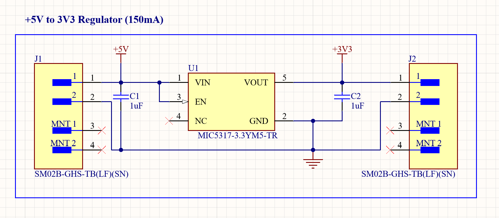

# PCB Circuit Design Portfolio

Hardware design portfolio featuring Altium Designer and KiCad projects with schematics, board layouts, and manufacturing-ready outputs.

---

## Projects

### A. 5V → 3.3V LDO Voltage Regulator

**Tool:** Altium Designer  
**Category:** Power Electronics  
**Status:** ✅ Complete — Gerbers generated

#### Overview

A compact low-dropout (LDO) linear voltage regulator that converts a 5V input to a stable 3.3V output, suitable for powering low-power microcontrollers, sensors, and other 3.3V logic.

#### Schematic

#### Key Components

| Ref | Part Number | Description |
|-----|-------------|-------------|
| U1 | MIC5317-3.3YM5-TR | 150mA LDO voltage regulator, SOT-23-5 |
| C1 | 1µF ceramic (X5R/X7R) | Input decoupling capacitor |
| C2 | 1µF ceramic (X5R/X7R) | Output stabilization capacitor |
| J1 | SM02B-GHS-TB(LF)(SN) | 2-pin JST-GH input connector (5V) |
| J2 | SM02B-GHS-TB(LF)(SN) | 2-pin JST-GH output connector (3.3V) |

#### Design Details

- **Input voltage:** 5V (via JST-GH connector)
- **Output voltage:** 3.3V regulated
- **Max output current:** 150mA
- **Dropout voltage:** 155mV typical at full load
- **Input capacitor:** 1µF ceramic for input stability and high-frequency filtering
- **Output capacitor:** 1µF ceramic for output regulation and transient response
- **Enable pin:** Active high, directly tied to VIN (always-on configuration)
- **NC pin:** Left unconnected per datasheet recommendation

#### Design Decisions

- **MIC5317 selected** for its low quiescent current (29µA), making it suitable for battery-powered or low-standby-power applications.
- **JST-GH connectors** chosen for their compact footprint and secure locking mechanism, ideal for prototype and bench-testing setups.
- **Minimal BOM** — only 5 components, keeping the design simple and easy to assemble by hand.

#### Manufacturing Outputs

Gerber files, drill files, and a DRC-clean report are included in the `Project Outputs for LDO_Converter/` directory, ready for fabrication at any PCB manufacturer (JLCPCB, PCBWay, etc.).

---

*More projects coming soon — including high-speed digital, mixed-signal, RF, and embedded systems designs.*